

  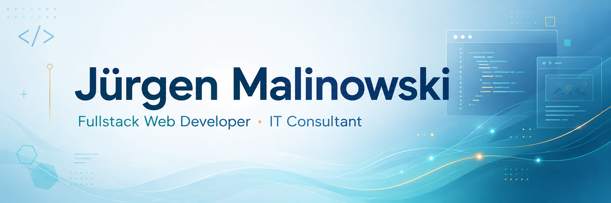

  Fullstack Web Developer with a strong background in business, consulting and customer communication. 
  I combine software development with process-oriented thinking and a strong interest in IT Consulting.

  

  

## Tech Stack

### Frontend

  

### Backend

  

### Tools & Infrastructure

  

## About Me

I am a certified Fullstack Web Developer with a strong background in business, consulting and customer communication.

My technical focus is on JavaScript, TypeScript and Angular in the frontend, as well as Python, Django and Django REST Framework in the backend. I also work with PostgreSQL, Docker, Git, GitHub and test-driven development with pytest.

Before moving professionally into software development, I gained many years of experience in consulting, sales and business processes, including more than eight years in financial consulting. This background helps me understand requirements from both a technical and a business perspective.

Alongside software development, I am particularly interested in IT Consulting as a combination of technology, process analysis and client-oriented problem solving.

AI is an integral part of my development workflow and supports me in planning, analysis, coding, debugging and quality assurance.

## Professional Strengths

- **Consulting & Sales** – More than eight years of experience in client consulting, needs analysis, solution-oriented communication, conflict prevention and sales.

- **Leadership & Training** – Five years of experience in leading and training sales teams, teaching IHK professional training and delivering courses in communication, telephone acquisition and sales techniques.

- **Business & Industry Knowledge** – Extensive experience in insurance and financial services, complemented by practical knowledge of banking, retail, automotive sales and logistics.

## Training Projects

The following projects were completed as part of my 12-month Fullstack Web Development training at Developer Akademie.

Each project focused on applying specific learning objectives in practice, with the technical complexity increasing progressively throughout the program. The projects are therefore presented here in reverse order, starting with the most advanced ones.

 

#### Videoflix

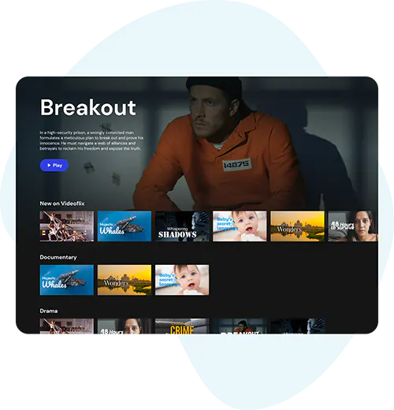

Netflix-inspired video streaming backend built with Django REST Framework.  
The project includes secure authentication, asynchronous video processing, multi-resolution HLS streaming, caching and containerized deployment.

**Tech Stack:** Python · Django · Django REST Framework · PostgreSQL · Redis · Django RQ · FFmpeg · HLS · Docker · Gunicorn · pytest

---

#### Quizly

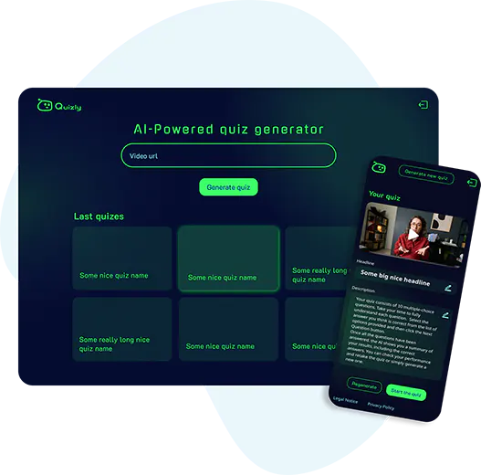

AI-powered backend that transforms YouTube videos into interactive quizzes.  
Video audio is extracted and transcribed with Whisper before Gemini automatically generates quiz questions from the transcription.

**Tech Stack:** Python · Django · Django REST Framework · Whisper · Gemini API · yt-dlp · FFmpeg · JWT · pytest

---

#### Coderr

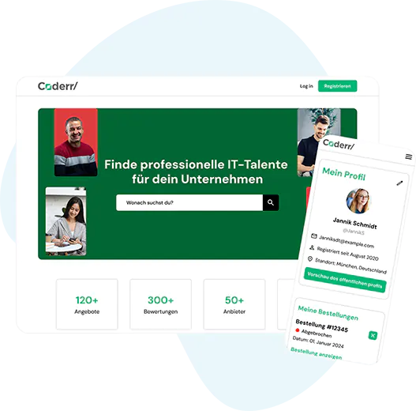

Backend for a freelancer developer platform connecting customers with business users and their service offers.  
The application provides APIs for authentication, user profiles, offers, orders and reviews and integrates with a separately developed frontend.

**Tech Stack:** Python · Django · Django REST Framework · REST APIs · Authentication · pytest

---

#### KanMind

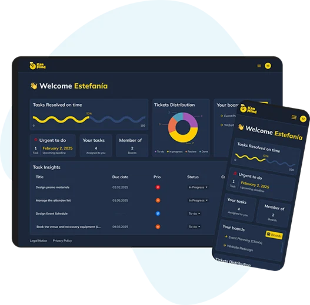

Backend for a project management application with boards, tasks and comments.  
The project focuses on structured REST APIs, authentication, object-level permissions and the integration of an existing frontend with a Django backend.

**Tech Stack:** Python · Django · Django REST Framework · REST APIs · Token Authentication · Permissions

  

#### Portfolio

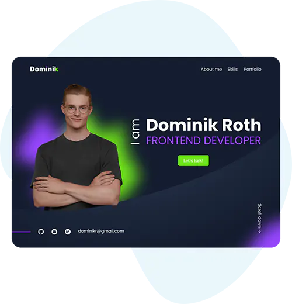

Personal portfolio website created to present projects, skills and profile in a clear and professional way.  
The project highlights frontend structure, design implementation and personal presentation.

**Tech Stack:** HTML · CSS · JavaScript

---

#### El Pollo Loco

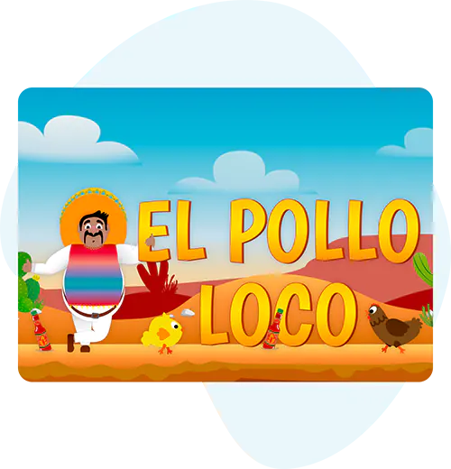

Browser-based jump-and-run game developed with object-oriented JavaScript and Canvas.  
The project focuses on game logic, object interaction, animation and structured frontend programming.

**Tech Stack:** HTML · CSS · JavaScript · OOP · Canvas

---

#### Join

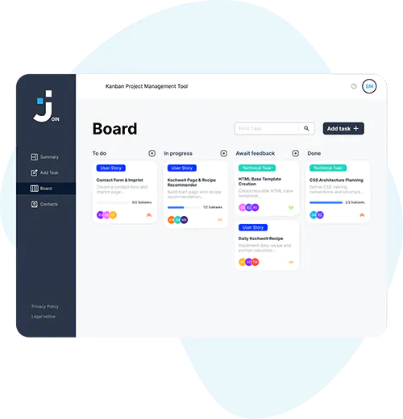

Kanban-based project management application developed in team collaboration.  
This project gave me hands-on experience in working in a structured development team using Scrum and Kanban principles.

**Tech Stack:** HTML · CSS · JavaScript · Firebase

---

#### Pokedex

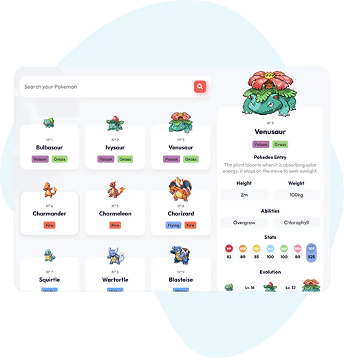

Pokédex web application built with API integration.  
The project focuses on working with external data sources, dynamic rendering and interactive user interface behavior.

**Tech Stack:** HTML · CSS · JavaScript · REST API

---

#### Bestell App

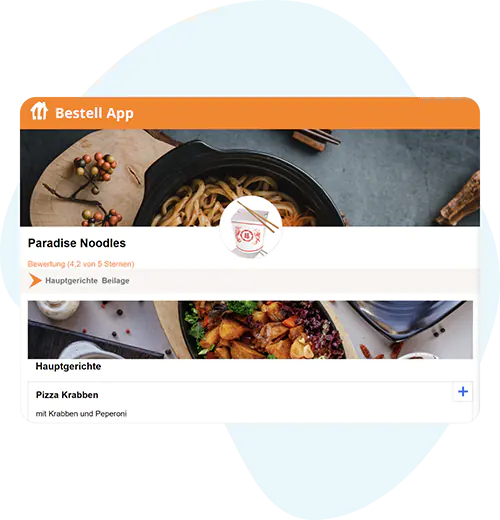

Ordering app for practicing shopping cart functionality and more advanced business logic in JavaScript.  
The project helped deepen my understanding of state handling and interactive frontend behavior.

**Tech Stack:** HTML · CSS · JavaScript

---

#### Bookstore

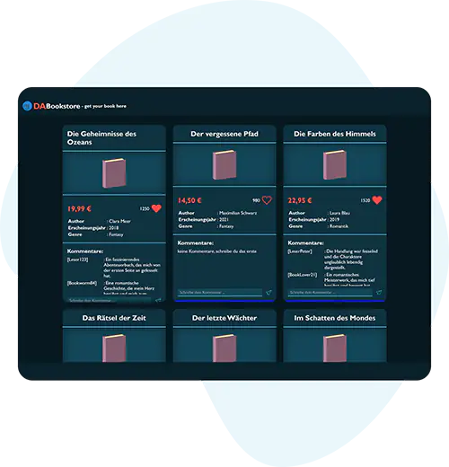

Frontend bookstore application working with larger JSON structures and dynamic content rendering.  
Users can browse books and interact with the application through client-side functionality.

**Tech Stack:** HTML · CSS · JavaScript · JSON

---

#### Fotogram

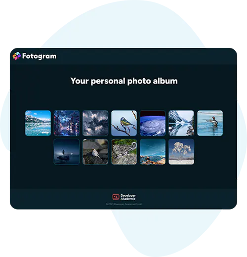

Photo app inspired by social media interaction.  
The project focuses on JavaScript-based interactivity, rendering media content and improving frontend user experience.

**Tech Stack:** HTML · CSS · JavaScript

---

#### Sakura Ramen Responsive

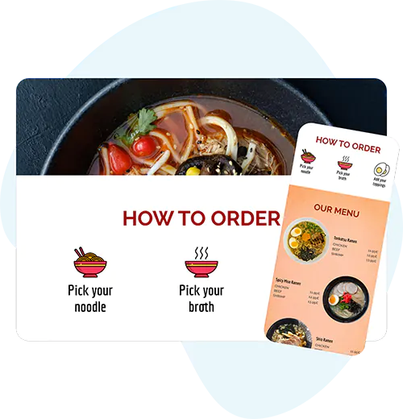

Responsive version of the Sakura Ramen website.  
This project focused on adapting layouts for different screen sizes and creating a clean user experience across devices.

**Tech Stack:** HTML · CSS · Responsive Design

---

#### Sakura Ramen

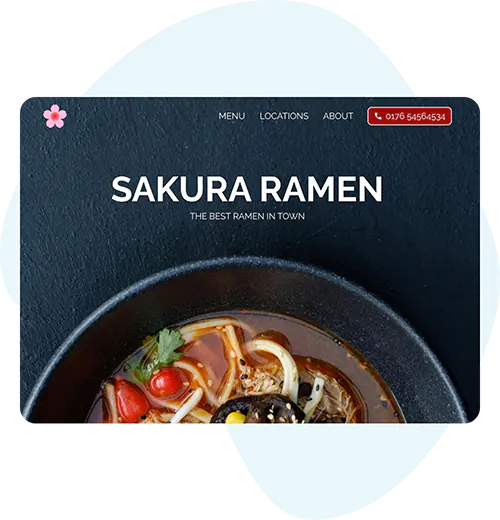

One of my first frontend training projects: a website for a Japanese ramen restaurant.  
The project focused on building a structured desktop layout and applying core HTML and CSS fundamentals.

**Tech Stack:** HTML · CSS

---

